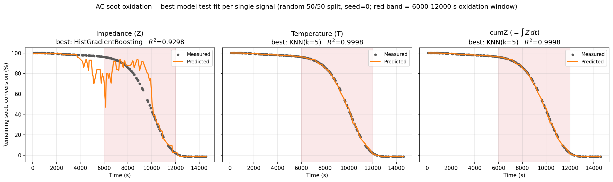
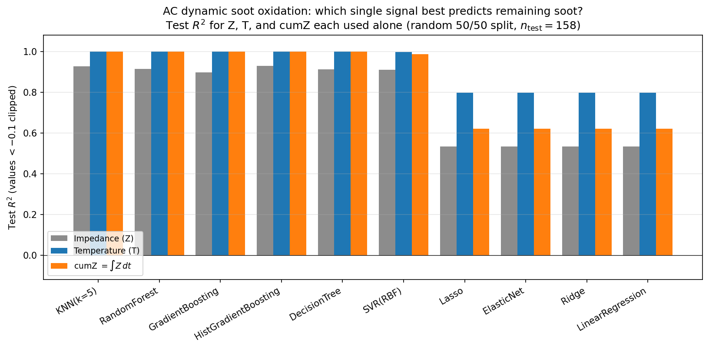

# AC soot oxidation — Z / T / cumZ

The AC version of the DC R/T/cumR study, for the SI. Same idea: predict how much
soot is left during AC-mode oxidation, and see which single signal carries the
information.

Three signals, each used on its own:

- **Z** — the raw AC impedance (Ω). DC's `R`.
- **T** — temperature (°C). Needs a thermocouple.
- **cumZ** — `∫Z dt` (Ω·s), the running integral of impedance. DC's `cumR`.

Target is the remaining-soot trace (100 % → 0 %). One aligned table, random 50/50
split, seed 0, best of 10 models — exactly the DC recipe. The red band (6000–12000 s,
the same window as the DC study) is the part that's hardest to get right.

## What came out

| Signal | Best model | R² | MAE in window |
|---|---|---|---|
| Z | HistGradientBoosting | 0.93 | 9.1 % |
| T | KNN | 0.9998 | 0.65 % |
| cumZ | KNN | 0.9998 | 0.61 % |

Same conclusion as DC: raw **Z** stalls around 0.93 and gets noisy right in the
oxidation window, but **cumZ alone climbs back to ~0.9998** — matching temperature
without ever needing a thermocouple.

You can see it in the fits — Z is jagged, T and cumZ sit right on the data:



And across all 10 models, cumZ (orange) tracks temperature (blue) while Z (grey)
trails:



## Files

- `run.py` — regenerates everything (deterministic, seed 0)
- `datasets/ac_aligned.csv` — the aligned table (316 rows)
- `data/` — leaderboards, predictions, summary, R² table
- `figures/` — the fit and R² plots above

To rerun:

```bash
python Surface-Fouling-ML/ac_soot_oxidation_si/run.py
```

It reads `Copy of AC soot oxidation ramping ML data.xlsx` from the project root.
Temp, soot, and Z come on three different time axes, so Temp and Z are
interpolated onto the soot timestamps to line everything up.
