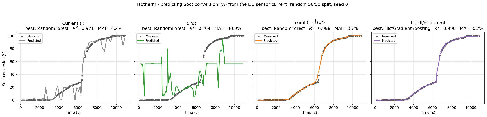
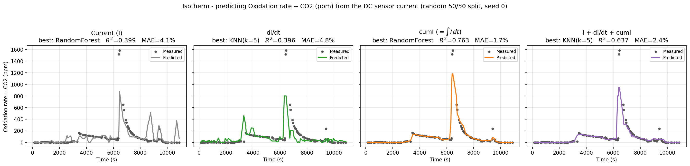

# Predicting soot oxidation from the DC sensor current

**The question:** during isothermal soot burning, can we predict soot oxidation
from the sensor **current alone** — no thermocouple, no CO₂ analyzer, just the
current the sensor already reads?

Short answer: **yes for how much soot has burned, and it's basically perfect.**

---

## The experiment

Soot is preloaded on the sensor, then the temperature is stepped up
(~370 → 470 → 570 → 670 °C). At each step the soot burns and gives off CO₂. We
record three things on their own time axes:

- **Temperature** (°C)
- **CO₂** (ppm) — the combustion product, i.e. how fast soot is burning right now
- **Current** (A) — the DC sensor signal

Most of the soot (≈71 %) burns off in the 570 °C step, which is also where the
current drops sharply — soot is conductive, so as it burns away the current falls.

---

## What we predict

Two flavors of "oxidation", both taken from the CO₂ signal (ground truth):

- **Soot conversion (%)** — cumulative CO₂ (area under the CO₂ curve), normalized
 to 100 %. This is *how much soot has burned so far*.
- **Oxidation rate (ppm)** — the instantaneous CO₂, i.e. *how fast it's burning
 right now*.

The **input is always the current only**. We use three current-derived features:

- `I` — the raw current
- `dI/dt` — how fast the current is changing
- `cumI = ∫I dt` — the running (cumulative) integral of the current

We line the current up with the CO₂ timestamps, then throw a zoo of 10 regression
models at each feature (linear models, SVR, KNN, trees, random forest, gradient
boosting) on a random 50/50 train/test split and keep the best. `MAE` below is
the mean error as a % of full scale.

---

## Results

### Soot conversion — nailed it

| Feature | Best model | R² | MAE |
|---|---|---|---|
| Current | RandomForest | 0.971 | 4.2 % |
| dI/dt | RandomForest | 0.204 | 30.9 % |
| **cumI = ∫I dt** | RandomForest | **0.998** | **0.7 %** |
| I + dI/dt + cumI | HistGradientBoosting | **0.999** | **0.7 %** |

The raw current already gets you most of the way (R²=0.97) but it's jagged. The
**cumulative current `cumI` gives a clean, near-perfect S-curve — R²=0.998, under
1 % error.** That's the whole conversion curve reconstructed from nothing but the
current.

### Oxidation rate — harder

| Feature | Best model | R² | MAE |
|---|---|---|---|
| Current | RandomForest | 0.399 | 4.1 % |
| dI/dt | KNN | 0.396 | 4.8 % |
| **cumI** | RandomForest | **0.763** | **1.7 %** |
| I + dI/dt + cumI | KNN | 0.637 | 2.4 % |

The instantaneous rate is a spiky signal, so it's tougher. `cumI` still does best
(R²=0.76) and catches the big 570 °C peak and its decay, but the two tallest spikes
(~1580 ppm) get clipped.

---

## The insight

**Cumulative current `∫I dt` is the signal that does the work.** A single current
reading is ambiguous — the same value shows up at different points of the burn —
but the cumulative integral is monotonic and remembers the whole history, so it
maps cleanly onto how much soot is gone.

This is the exact same story we saw on the ramp data with `cumR` (DC resistance)
and `cumZ` (AC impedance): **the raw signal underperforms, and its cumulative
integral recovers near-perfect prediction.** So it holds across resistance,
impedance, *and* current — the "cumulative feature" trick is general.

**Bottom line:** with just the sensor current, we can read out soot conversion to
better than 1 % — a real-time, thermocouple-free way to know how much soot is left.

---

*Reproduce: `python Surface-Fouling-ML/isotherm_exploration/run.py` (seed 0,
deterministic). Aligned data in `datasets/`, per-model tables in `data/`, figures
in `figures/`.*
