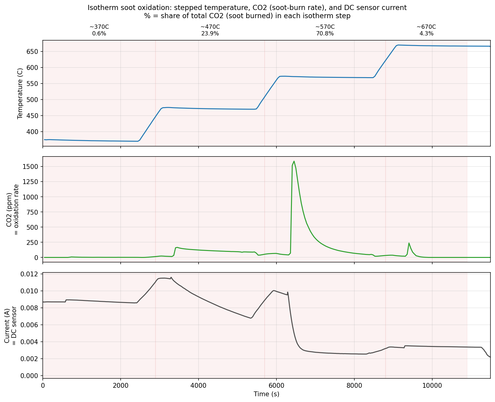

# 恒温 soot 氧化 case — 我的理解 & 待办

这是给我自己看的笔记,记录我们对那份**恒温(isotherm)数据**的讨论:数据是什么、
他们大概想让我做什么、以及真要做出来还缺什么。等周五开完会再更新。

数据来源:`Copy of AC soot oxidation ramping ML data.xlsx` 的第二张表
**"Isotherm condition"**(第一张表是动态升温的 AC ramp,已经做完,在
`../ac_soot_oxidation_si/`)。

---

## 1. 这份数据是什么

一个**阶梯恒温**的 soot 燃烧实验:预先load 好 soot,然后把温度一档一档升上去,
每个温度停一段时间,看 soot 在各温度下烧得怎么样。

对应 PDF `12-02-2025 sensor data discussion` 第 9 页:
> "Soot oxidation is conducted at **isotherm conditions**, while temperature
> contributes the oxidation rate change. ... **linear calibration of soot
> oxidation rate**."

表里三列有用的:

| 列 | 含义 |
|---|---|
| `Temperature-ISOTHERM` | 温度(°C),走 370 → 470 → 570 → 670 四个台阶 |
| `CO2-ISOTHERM` | 出口 CO₂ 浓度(ppm)= **soot 氧化速率** |
| `Current-ISOTHERM` | DC 传感器电流(A)= **传感器信号** |

(注:CO₂ 有 -2、-3 的负值,是分析仪零点漂移,算积分时截成 0。)



---

## 2. 为什么 CO₂ = 氧化速率(别忘了)

- soot ≈ 碳,烧掉就变 CO₂:`C + O₂ → CO₂`。测到多少 CO₂ = 这一刻烧了多少 soot。
- 这是**流通式反应器**(气体固定流量一直吹过),生成的 CO₂ 立刻被冲走,不累积。
  所以 **CO₂ 浓度(瞬时)= 氧化速率**,不是总量。
- 推论:
  - CO₂ 曲线**高度** = 烧得多快(速率)
  - CO₂ 曲线**面积**(∫CO₂ dt)= 总共烧了多少(量)

---

## 3. 两种氧化机制(这就是重点)

催化剂(LSCO)把 soot 起燃温度压低了 ~80°C,所以氧化分两段,对应 abstract 那句
*"two-range linear calibration model ... catalytic and thermal oxidation mechanisms"*:

- **低温段(~470°C)= 催化氧化**:没有催化剂这温度根本不烧,是催化剂让它烧的。
- **高温段(~570°C 以上)= 催化 + 热氧化**:非催化的热氧化也开始贡献。

我按每个台阶对 CO₂ 积分,算了各温度烧掉的 soot 占比:

| 台阶 | 烧掉占比 | 说明 |
|---|---|---|
| 370 °C | 0.6% | 太冷,几乎不烧 |
| **470 °C** | **23.9%** | 催化为主 |
| **570 °C** | **70.8%** | 催化 + 热(主峰) |
| 670 °C | 4.3% | soot 基本烧完了 |

---

## 4. 他们大概想让我做什么

PDF 第 7 页原话:*"How can AI help to **deconvolute contribution from different
factors**"*。结合讨论,目标八成是:

> **给一段传感器数据,反推出催化氧化和热氧化各自的贡献是多少。**

完整链条应该是:

```
sensor 信号 + 温度  ──标定──▶  总氧化速率  ──two-range 模型──▶  催化份 / 热份
```

---

## 5. 要做到这个,缺什么 / 注意什么

这块是关键,周五要确认:

**(1) 想"真拆"出两种贡献,必须先定义"纯热氧化"是多少**

CO₂ 测的是**总速率**(催化+热混在一起),没有任何一列单独告诉我热的占多少。
要拆开,两条路:

- **路 A(干净,首选):有"无催化剂"对照实验。** 如果做过裸 SiC(不镀 LSCO)的
  soot 氧化,那条曲线就是**纯热氧化** rate_thermal(T),于是
  `催化贡献 = 总速率 − 热速率`(同温度相减)。这是真测出来的拆分。
- **路 B(没对照,只能假设):two-range 模型。** 假设催化、热各服从一个 Arrhenius
  规律(ln(rate) vs 1/T 两段直线),低温段算催化、高温多出来的算热,转折点 = 热氧化
  接管的温度。能做,对得上 abstract,但是假设驱动,不如 A 硬。

**(2) 光靠 sensor 一个数拆不出来,输入必须带温度**

同一个传感器读数,可能是低温催化烧的、也可能是高温热烧的——速率一样机制不同。
所以输入得是 **(sensor 信号 + 温度/时间)**,这跟 ramp 那份 cumZ/cumR 需要时间历史
是一个道理。

**(3) 数据量的限制**

这份恒温只有 4 个温度台阶(370/470/570/670),每个机制就 2 个点,做 Arrhenius
两段拟合**点太少**。可能还有更多温度的数据没给我。

---

## 6. 周五要问清楚的

1. 有没有 **no-catalyst(裸 SiC)对照**实验?→ 决定能"真拆"还是只能"假设拆"。
2. 除了这 4 个温度,还有没有**更多 isotherm 温度点**?→ 决定拟合站不站得住。
3. 输出要的是哪种:
   - 给条曲线 → 标出催化/热各占多少(后处理分析),还是
   - 实时给个 sensor 读数 → 输出此刻两种机制的瞬时贡献(预测器)?
4. 目标变量是 **氧化速率(CO₂)** 还是 **剩余 soot 质量**?标定是 current→rate 还是 current→mass?
5. AC 也要做吗?(这份恒温只有 DC 的 current;AC 的 Z 在 ramp 那份里。)
6. 这个进正文还是 SI?要不要和 ramp 那份的 cumZ 结果串成一个完整故事?

---

## 文件

- `isotherm_overview.png` — 温度 / CO₂ / 电流随时间的总览图(上面那张)
- 还没建分析脚本,等周五确认目标后再写。
