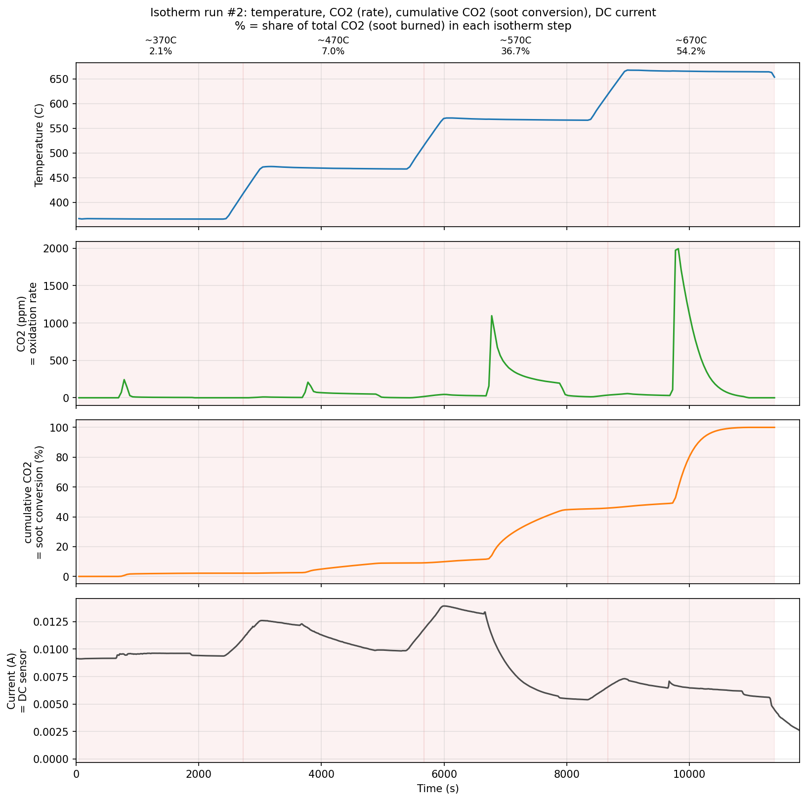
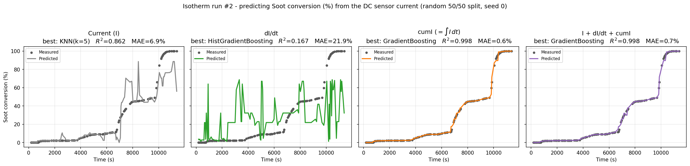
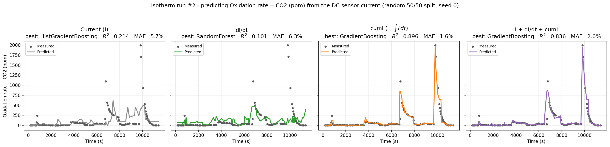

# Predicting soot oxidation from the DC sensor current — isotherm run #2

Same question as run #1 (`../isotherm_exploration`), new experiment: during
isothermal soot burning, can we predict soot oxidation from the sensor **current
alone**? This run is an independent repeat, so it doubles as a replication test.

Short answer: **same result — soot conversion from cumI is near-perfect (R²≈0.998),
and this time even the rate gets to R²≈0.90.**

---

## The experiment

Soot preloaded, temperature stepped ~370 → 470 → 570 → 670 °C. Same three signals:
temperature, CO₂ (ppm, = how fast soot burns right now), and the DC current.

One real difference from run #1: **most of the soot burns in the 670 °C step here
(54 %)**, whereas run #1 burned out at 570 °C (71 %). Burn shares per step:
2 % / 7 % / 37 % / 54 %.

---

## What we predict

Both targets come from the CO₂ signal (ground truth); input is the current only:

- **Soot conversion (%)** — cumulative CO₂, normalized. "How much has burned so far."
- **Oxidation rate (ppm)** — instantaneous CO₂. "How fast it's burning now."

Features: `I` (raw current), `dI/dt`, `cumI = ∫I dt`. Random 50/50 split, seed 0,
best of the same 10-model zoo. MAE is % of full scale.

---

## Results

### Soot conversion — nailed it again

| Feature | Best model | R² | MAE |
|---|---|---|---|
| Current | KNN | 0.862 | 6.9 % |
| dI/dt | HistGradientBoosting | 0.167 | 21.9 % |
| **cumI = ∫I dt** | GradientBoosting | **0.998** | **0.6 %** |
| I + dI/dt + cumI | GradientBoosting | 0.998 | 0.7 % |

Note the raw current actually got *worse* than in run #1 (0.86 vs 0.97) — but
**cumI doesn't care**: still 0.998, under 1 % error.

### Oxidation rate — better than run #1

| Feature | Best model | R² | MAE |
|---|---|---|---|
| Current | HistGradientBoosting | 0.214 | 5.7 % |
| dI/dt | RandomForest | 0.101 | 6.3 % |
| **cumI** | GradientBoosting | **0.896** | **1.6 %** |
| I + dI/dt + cumI | GradientBoosting | 0.836 | 2.0 % |

Run #1 topped out at 0.76 for the rate; this run reaches **0.90**, catching the main
670 °C burn peak and its decay.

---

## The insight

**The cumulative-current trick replicates.** Across two independent isothermal runs
with different burn profiles (run #1 burned at 570 °C, run #2 at 670 °C), the story
is identical: raw current is mediocre and unstable between runs, but **`cumI = ∫I dt`
reads soot conversion to <1 % error both times.** That's now cumR (DC ramp), cumZ
(AC ramp), and cumI twice (isothermal) — the cumulative integral of the sensor
signal is the robust, general feature.

**Bottom line:** one integral of the current the sensor already records gives you
how much soot has burned, reproducibly, to better than 1 %.

---

*Reproduce: `python Surface-Fouling-ML/isotherm_exploration_2/run.py` (seed 0,
deterministic). Aligned data in `datasets/`, per-model tables in `data/`, figures in
`figures/`.*
