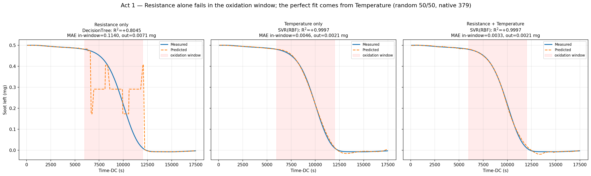
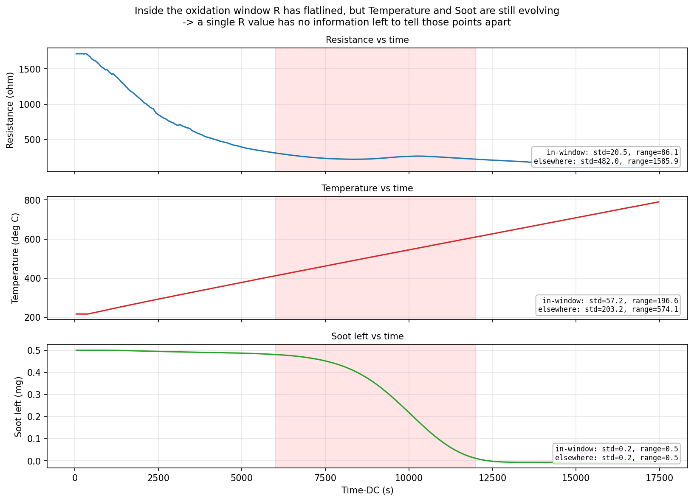
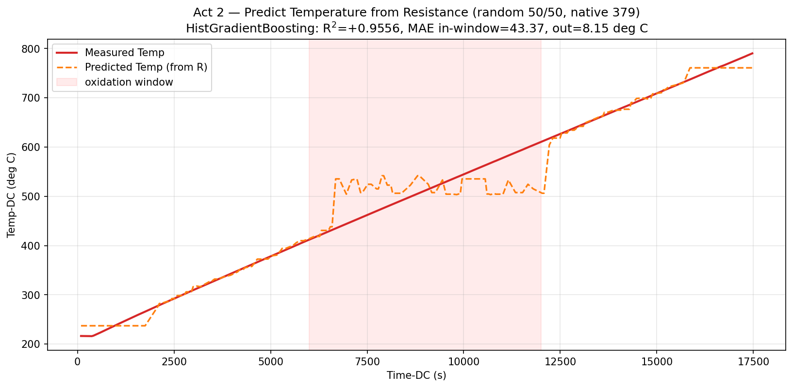
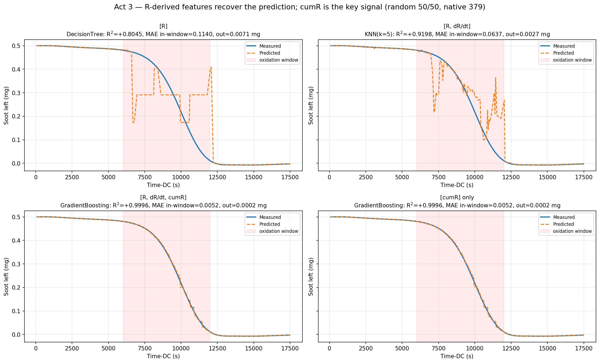
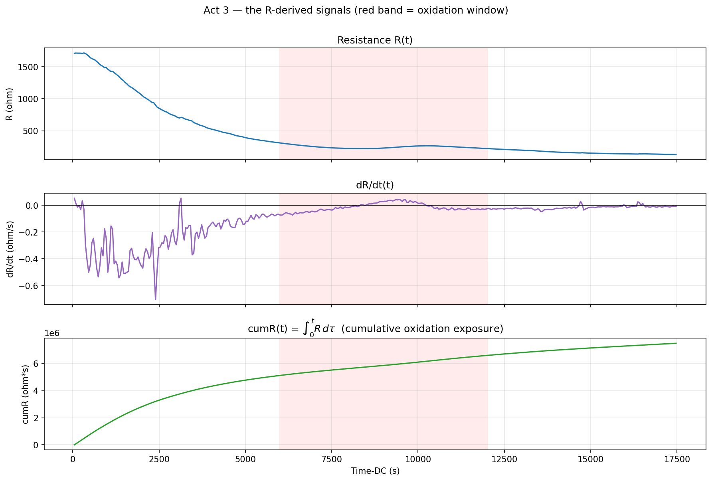

# Predicting soot mass from sensor signals

**Goal:** predict remaining soot mass from sensor signals — and find out which
signal actually does the work.
**Setup:** one dataset (`datasets/native_379.csv`, 379 rows), random 50/50 split,
`seed=0`, best of 10 models. Red band = **6000–12000 s oxidation window** (most
intense oxidation → the region that matters most, and where things break).

---

##  Resistance fails; Temperature does all the work

| Features | Best model | R² | MAE in window |
|---|---|---|---|
| Resistance only | DecisionTree | **0.80** | 0.114 mg |
| Temperature only | SVR | **0.9997** | 0.005 mg |
| Resistance + Temperature | SVR | 0.9997 | 0.003 mg |

→ R alone breaks in the window (~16× worse there). T alone is already perfect;
adding R changes nothing. **The predictive power is Temperature, not Resistance.**

---

##  Why R fails: in the window it carries no information

In the window R is flat (std **20 Ω**) while Temperature and Soot keep evolving
(T std 57, range ~200 °C). A single R value simply can't tell those points apart.

Confirm it by predicting Temperature **from** R: R²=0.96 overall, but in the
window the error jumps **5×** (43 °C vs 8 °C) — R flat-lines while T climbs.

→ R stops carrying information exactly where it fails on soot. **Same failure.**

---

## Act 3 — Recover it from Resistance alone, via `cumR`

`cumR = ∫₀ᵗ R dτ` — cumulative resistive exposure (physically meaningful:
accumulated oxidation). Monotonic, and unlike a
single R reading it remembers process history.

| Features | R² | MAE in window |
|---|---|---|
| `R` | 0.80 | 0.114 mg |
| `R, dR/dt` | 0.92 | 0.064 mg |
| `R, dR/dt, cumR` | **0.9996** | 0.005 mg |
| `cumR` alone | **0.9996** | 0.005 mg |

→ Adding `cumR` closes the gap back to the Temperature ceiling — **using
resistance only**. `cumR` alone already does it.

→ R(t) is ambiguous in the window and dR/dt is noisy, but `cumR` is a clean
monotonic curve carrying the history a single R sample throws away.

---

## Takeaway

R alone fails in the oxidation window because an instantaneous reading loses its
one-to-one link with the process (Act 2) — restoring that history with the
physically grounded `cumR` recovers near-perfect prediction **from resistance
alone** (Act 3).

