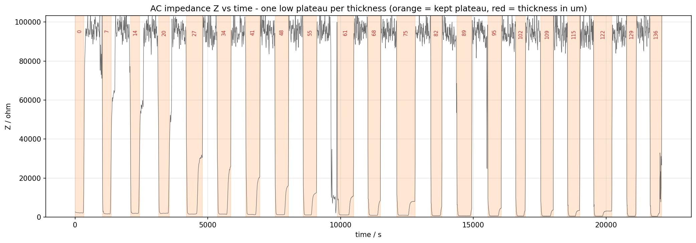
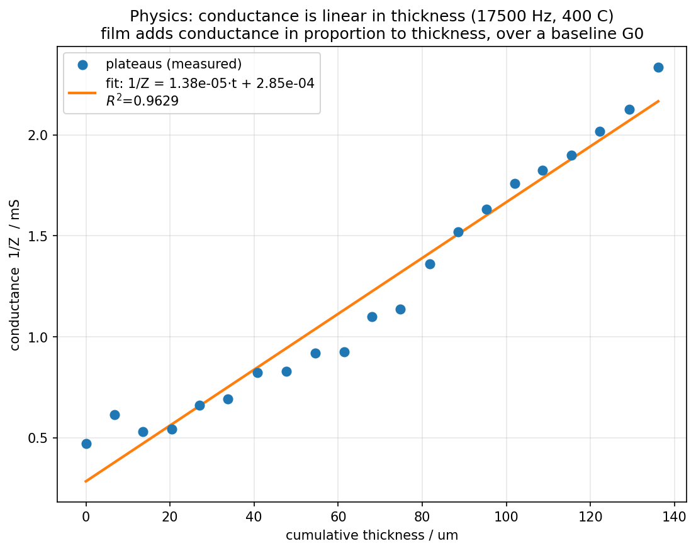
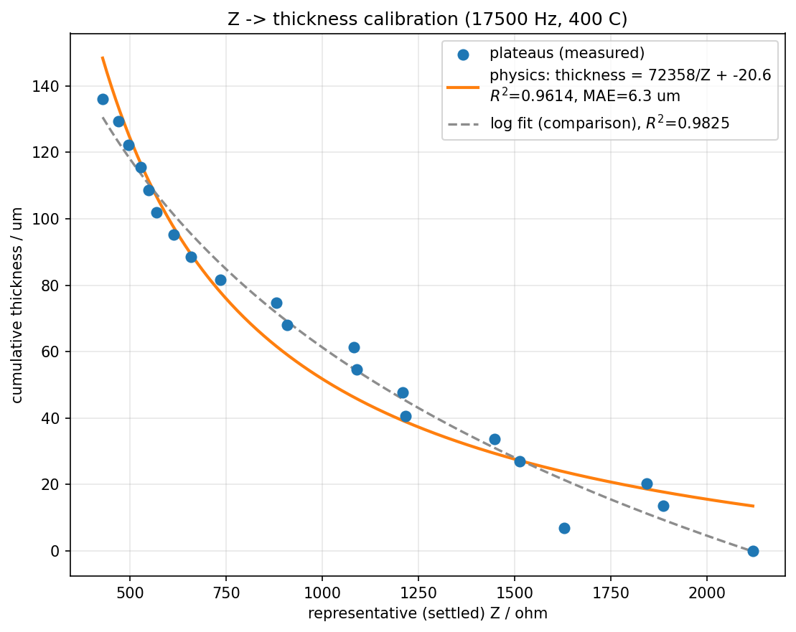
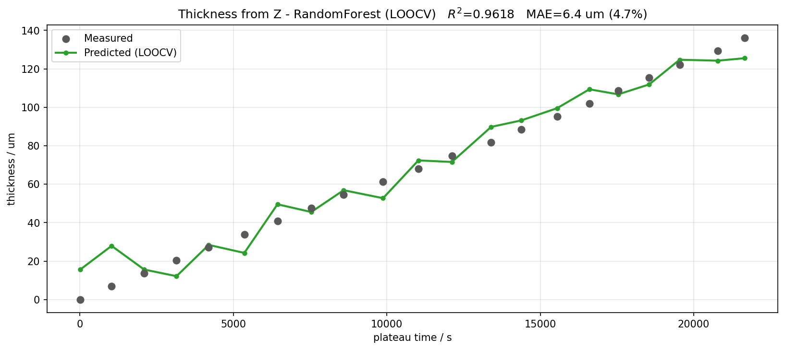
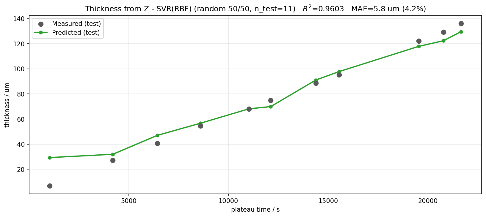

# Predicting coating thickness from AC impedance

**The question:** can we read the coating thickness straight off the AC impedance
`Z`? Data: sheet `17500Hz_400C_AC vs Time` (17.5 kHz, 400 °C).

Short answer: **yes — thickness is basically a straight line in ln(Z), R²≈0.98.**

---

## The experiment

The thickness is built up in ~6.7 µm steps, 0 → 136 µm (21 levels). At each level
the impedance is measured for a while, then it jumps to a ~95 kΩ reference state
between measurements. So `Z` vs time is a train of plateaus — **one low plateau per
thickness:**

The orange bands are the measurement plateaus, labelled with their thickness (µm).
The settled **low** Z is the useful part — as more material goes down the film gets
more conductive, so Z drops. The ~95 kΩ high state is just a reference; it's the
same every cycle and carries no thickness info.

---

## Method

1. **Segment** the low plateaus (Z < 40 kΩ), one per thickness level.
2. **Reduce** each plateau to a single representative Z = median of its 10 lowest
 samples (the settled, conductive value).
3. **Pair** the 21 plateaus with the 21 thickness levels in time order. (One extra
 plateau turned up — a short noise burst around 9600 s — so we drop the shortest
 and land on a clean 21 ↔ 21.)
4. **Calibrate (physics)** — the film adds conductance in proportion to its
 thickness, on top of a baseline substrate conductance:
 `1/Z = k·thickness + G₀`, i.e. `thickness = a/Z + b`.
5. **ML** — a 10-model zoo predicts thickness from the raw representative Z, scored
 with leave-one-out CV (only 21 points, so LOOCV beats a single split).

---

## Results

**The physics** — conductance `1/Z` is linear in thickness, with a nonzero baseline
`G₀` (the bare substrate still conducts): **R² = 0.963**.

**Calibration curve** — inverting that gives `thickness = 72358/Z − 20.6`,
**R² = 0.961, MAE = 6.3 µm (4.6 %)**. (An empirical log fit reaches R² = 0.982 and is
shown dashed for comparison — it fits marginally better but isn't physically grounded.)

**ML (leave-one-out)** — best is RandomForest, **R² = 0.962, MAE = 6.4 µm (4.7 %)**.
Every point is held out and predicted from the other 20, so all 21 points here are
out-of-sample (test) predictions.

| Model | LOOCV R² | MAE |
|---|---|---|
| RandomForest | 0.962 | 4.7 % |
| DecisionTree | 0.959 | 5.7 % |
| KNN(k=3) | 0.953 | 5.5 % |
| SVR(RBF) | 0.926 | 5.0 % |
| Linear / Ridge / Lasso | 0.909 | 7.9 % |

**ML (random 50/50 split)** — same protocol as the ramp/isotherm analyses, showing the
held-out test half. Best is SVR(RBF), **R² = 0.960, MAE = 5.8 µm (4.2 %)** on 11 test
points. (Tree models drop to ~0.90 here — with only 10 training points they have less to
work with, which is why LOOCV is the more reliable read.)

---

## The insight

**Conductance scales with thickness.** More material deposited → more conductive →
lower Z, and `1/Z` rises linearly with thickness. There's a baseline term `G₀` because
the bare substrate already conducts (at 0 µm, Z is a finite ~2 kΩ, not infinite) — that
baseline is why a naive `thickness = C/Z` misses at the thin end and only holds for
thick films. The full model `1/Z = k·thickness + G₀` reads thickness to ~5 % across the
whole 0–136 µm range, and it's physically interpretable: `k` = conductance per µm,
`G₀` = substrate conductance.

The one trick that makes it work: **you can't feed raw Z samples to a model** — within
one plateau Z swings from ~500 Ω to ~95 kΩ while thickness is fixed. You have to reduce
each plateau to its settled value first, *then* map to thickness.

**Bottom line:** the settled AC conductance is linear in thickness, giving thickness to
a few microns from one physically-grounded calibration.

---

*Reproduce: `python Surface-Fouling-ML/thickness_from_Z/run.py`. Calibration points
and the model leaderboard are in `data/`, figures in `figures/`.*
